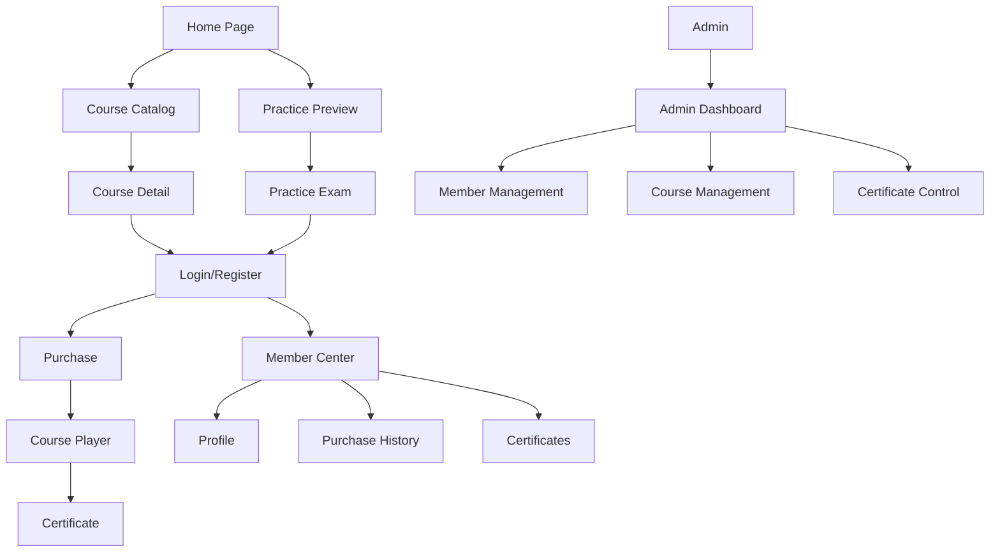

## 1. Product Overview

A professional cross-platform learning platform with real-name registration ensuring certificates match legal names. The platform offers paid online courses and license exam practice with 90-day access periods, automatic certificate generation, and comprehensive admin management.

Target market: Financial industry professionals requiring certified training and license exam preparation with verifiable completion certificates.

## 2. Core Features

### 2.1 User Roles

| Role | Registration Method | Core Permissions |
|------|---------------------|------------------|
| Visitor | No registration required | Browse catalog, 1-minute preview, 5 free practice questions |
| Member | Email registration with real-name verification | Full course access, purchase products, track progress, generate certificates, comment |
| Admin | Pre-configured accounts (2 total) | Full platform management, member control, content CRUD, certificate management |

### 2.2 Feature Module

The learning platform consists of the following main pages:

1. **Home page**: Course catalog, practice exam preview, industry updates, resource downloads
2. **Registration page**: Real-name registration with Chinese/English names, company info, document upload
3. **Login page**: Email/password authentication with optional OTP
4. **Course detail page**: Course overview, chapter list, 1-minute preview, purchase option
5. **Course player page**: Video streaming, chapter progress, in-video questions, resume functionality
6. **Practice exam page**: Question bank, chapter selection, scoring, explanations
7. **Member center page**: Profile management, purchase history, certificates, learning progress
8. **Certificate page**: PDF certificate download, verification QR code
9. **Admin dashboard**: Member management, payment records, course management, certificate control

### 2.3 Page Details

| Page Name | Module Name | Feature description |
|-----------|-------------|---------------------|
| Home page | Course catalog | Display available courses with thumbnails, pricing, and brief descriptions. Show purchase status for logged-in members. |
| Home page | Practice preview | Show 5 free practice questions with limited access, encourage purchase for full access. |
| Home page | Industry updates | List latest market news and announcements with external link support. |
| Home page | Resource downloads | Government resources available for download in PDF/DOCX/XLSX formats. |
| Registration page | Real-name form | Collect Chinese name (Family/Given), English name (Surname/Given), Company, Financial institution category dropdown, Phone, Email, MSO Association number. |
| Registration page | Document upload | Optional ID/company proof upload with file validation and secure storage. |
| Registration page | Real-name declaration | Mandatory checkbox confirming identity accuracy. |
| Login page | Authentication | Email/password login with optional OTP verification for enhanced security. |
| Course detail page | Course overview | Display course description, instructor info, total duration, and chapter breakdown. |
| Course detail page | Preview player | 1-minute video preview for non-purchasers, full access for purchasers. |
| Course detail page | Purchase option | Stripe integration for secure payment processing with 90-day access activation. |
| Course player page | Video streaming | HLS adaptive streaming with resume functionality and chapter progress tracking. |
| Course player page | In-video questions | Pause video for short answer and 4-choice MCQ questions with explanations. |
| Course player page | Progress tracking | Store per-chapter completion status and total viewing time in seconds. |
| Practice exam page | Question bank | Chapter-organized questions with scoring and detailed explanations. |
| Practice exam page | Free trial | Allow 5 questions for non-purchasers with purchase prompt for full access. |
| Member center page | Profile management | View locked name fields, edit allowed fields (Company, Phone, Email). |
| Member center page | Purchase history | Display all purchases with expiry dates and renewal options. |
| Member center page | Learning progress | Show course completion percentages and accumulated learning hours. |
| Member center page | Certificate list | Download PDF certificates with unique IDs and verification QR codes. |
| Certificate page | PDF generation | Auto-generate certificates with member name, course name, total time, completion date. |
| Certificate page | QR verification | Generate unique QR codes linking to public verification page. |
| Admin dashboard | Member management | Search, manually add/delete members, disable login, reset passwords. |
| Admin dashboard | Payment records | View all transactions with gateway IDs, filter by product type and date. |
| Admin dashboard | Course management | CRUD operations, video upload, chapter organization, pricing, question scheduling. |
| Admin dashboard | Certificate control | Edit templates, manually issue/cancel certificates, regenerate as needed. |

## 3. Core Process

### Visitor Flow
Visitors can browse the course catalog and practice preview without registration. They see course overviews with 1-minute video previews and can attempt 5 free practice questions. To access full content, visitors must register with real-name verification and purchase products.

### Member Flow
Members register with real-name information including Chinese/English names, company details, and optional document upload. After email verification, they can purchase courses or practice products through Stripe payment. Each purchase grants 90-day access. During course playback, in-video questions pause the video until answered. Progress is tracked per chapter with total viewing time accumulated. Upon completion, certificates are automatically generated with unique IDs and QR codes for verification.

### Admin Flow
Admins manage the platform through the backend dashboard. They can add/edit courses with video uploads, chapter organization, and in-video question scheduling. Member management includes searching, manual addition, account disabling, and real-name field editing. Payment records are tracked with gateway transaction IDs. Certificates can be manually issued, cancelled, or regenerated with customizable templates.

### Page Navigation Flow

## 4. User Interface Design

### 4.1 Design Style
- **Primary Colors**: Professional blue (#2563eb) for primary actions, gray (#6b7280) for secondary elements
- **Secondary Colors**: Success green (#10b981) for completions, warning orange (#f59e0b) for expiries
- **Button Style**: Rounded corners (8px radius), clear hover states, loading indicators
- **Typography**: Inter font family, 16px base size, responsive scaling
- **Layout**: Card-based design with consistent spacing (8px grid system)
- **Icons**: Feather Icons library for consistent iconography

### 4.2 Page Design Overview

| Page Name | Module Name | UI Elements |
|-----------|-------------|-------------|
| Home page | Course catalog | Grid layout with course cards showing thumbnail, title, duration, price, and progress indicator for members. Responsive 3-column on desktop, 1-column on mobile. |
| Course player page | Video player | Full-width video player with custom controls, chapter sidebar, progress bar with completion indicators, question overlay modal. |
| Member center page | Dashboard | Summary cards showing total learning hours, active courses, certificates earned, recent activity timeline. |
| Admin dashboard | Data tables | Sortable tables with search, filters, bulk actions, status badges, and pagination controls. |

### 4.3 Responsiveness
Desktop-first design approach with mobile adaptation. Breakpoints: 640px (mobile), 768px (tablet), 1024px (desktop). Touch-optimized interactions for mobile devices with larger tap targets and swipe gestures for navigation.