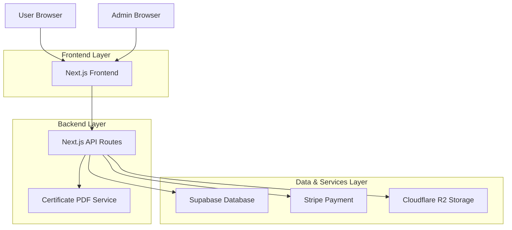
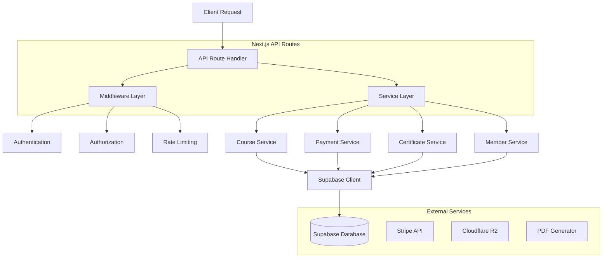
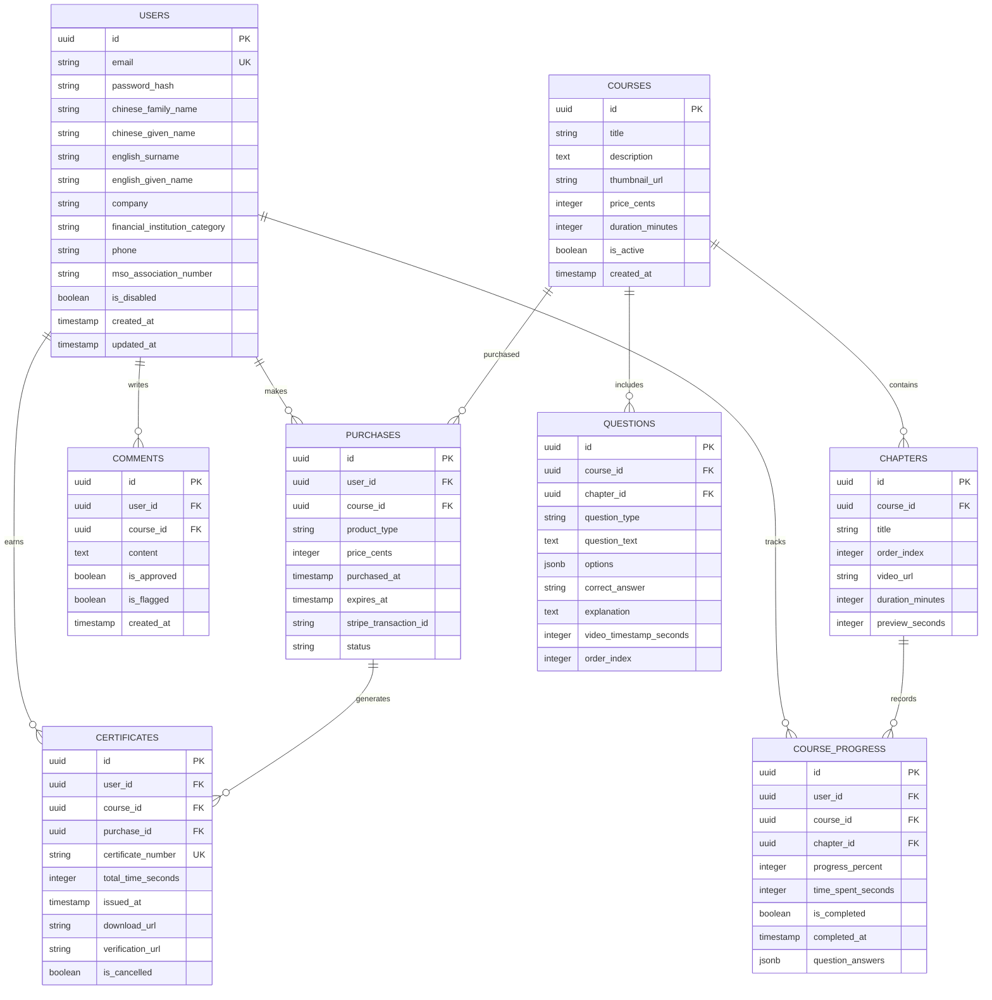

## 1. Architecture Design



## 2. Technology Description

- **Frontend**: Next.js@14 + React@18 + TypeScript + Tailwind CSS@3
- **Initialization Tool**: create-next-app
- **Backend**: Next.js API Routes (serverless functions)
- **Database**: Supabase (PostgreSQL)
- **Authentication**: Supabase Auth with email/password + optional OTP
- **Payment**: Stripe Integration
- **File Storage**: Cloudflare R2 (S3-compatible)
- **Video Streaming**: HLS with signed URLs
- **PDF Generation**: Puppeteer + HTML templates
- **PWA**: Next-PWA for offline capabilities

## 3. Route Definitions

| Route | Purpose |
|-------|---------|
| / | Home page with course catalog and industry updates |
| /auth/login | Member login page |
| /auth/register | Real-name registration page |
| /courses | Course catalog listing |
| /courses/[id] | Course detail page |
| /courses/[id]/play | Course video player |
| /practice | License exam practice |
| /member/profile | Member profile management |
| /member/purchases | Purchase history and expiry tracking |
| /member/certificates | Certificate download and verification |
| /admin | Admin dashboard |
| /admin/members | Member management |
| /admin/courses | Course management |
| /admin/payments | Payment records |
| /admin/certificates | Certificate management |
| /api/auth/* | Authentication API endpoints |
| /api/courses/* | Course-related API endpoints |
| /api/payments/* | Payment processing endpoints |
| /api/certificates/* | Certificate generation endpoints |

## 4. API Definitions

### 4.1 Authentication APIs

**POST /api/auth/register**
```typescript
// Request
{
  email: string;
  password: string;
  chineseFamilyName: string;
  chineseGivenName: string;
  englishSurname: string;
  englishGivenName: string;
  company: string;
  financialInstitutionCategory: string;
  phone: string;
  msoAssociationNumber?: string;
  realNameDeclaration: boolean;
  documents?: File[];
}

// Response
{
  user: {
    id: string;
    email: string;
    chineseName: string;
    englishName: string;
  };
  session: string;
}
```

**POST /api/auth/login**
```typescript
// Request
{
  email: string;
  password: string;
  otpCode?: string;
}

// Response
{
  user: User;
  session: string;
  requiresOtp: boolean;
}
```

### 4.2 Course APIs

**GET /api/courses**
```typescript
// Response
{
  courses: Array<{
    id: string;
    title: string;
    description: string;
    thumbnailUrl: string;
    price: number;
    duration: number;
    chapters: Chapter[];
    isPurchased: boolean;
    progress?: number;
  }>;
}
```

**POST /api/courses/[id]/purchase**
```typescript
// Request
{
  paymentMethodId: string;
}

// Response
{
  purchase: {
    id: string;
    courseId: string;
    expiresAt: string;
    transactionId: string;
  };
}
```

**POST /api/courses/[id]/progress**
```typescript
// Request
{
  chapterId: string;
  progress: number; // 0-100
  timeSpent: number; // seconds
  questionAnswers?: Array<{
    questionId: string;
    answer: string;
    isCorrect: boolean;
  }>;
}
```

### 4.3 Certificate APIs

**POST /api/certificates/generate**
```typescript
// Request
{
  courseId: string;
}

// Response
{
  certificate: {
    id: string;
    certificateNumber: string;
    downloadUrl: string;
    verificationUrl: string;
    qrCode: string;
  };
}
```

**GET /api/certificates/verify/[certificateNumber]**
```typescript
// Response
{
  valid: boolean;
  certificate: {
    memberName: string;
    courseName: string;
    completionDate: string;
    totalTime: number;
  };
}
```

## 5. Server Architecture Diagram



## 6. Data Model

### 6.1 Database Schema



### 6.2 Data Definition Language

```sql
-- Users table
CREATE TABLE users (
    id UUID PRIMARY KEY DEFAULT gen_random_uuid(),
    email VARCHAR(255) UNIQUE NOT NULL,
    password_hash VARCHAR(255) NOT NULL,
    chinese_family_name VARCHAR(100) NOT NULL,
    chinese_given_name VARCHAR(100) NOT NULL,
    english_surname VARCHAR(100) NOT NULL,
    english_given_name VARCHAR(100) NOT NULL,
    company VARCHAR(255),
    financial_institution_category VARCHAR(100),
    phone VARCHAR(50),
    mso_association_number VARCHAR(100),
    is_disabled BOOLEAN DEFAULT false,
    created_at TIMESTAMP WITH TIME ZONE DEFAULT NOW(),
    updated_at TIMESTAMP WITH TIME ZONE DEFAULT NOW()
);

-- Courses table
CREATE TABLE courses (
    id UUID PRIMARY KEY DEFAULT gen_random_uuid(),
    title VARCHAR(255) NOT NULL,
    description TEXT,
    thumbnail_url VARCHAR(500),
    price_cents INTEGER NOT NULL,
    duration_minutes INTEGER NOT NULL,
    is_active BOOLEAN DEFAULT true,
    created_at TIMESTAMP WITH TIME ZONE DEFAULT NOW()
);

-- Purchases table with 90-day expiry
CREATE TABLE purchases (
    id UUID PRIMARY KEY DEFAULT gen_random_uuid(),
    user_id UUID REFERENCES users(id) ON DELETE CASCADE,
    course_id UUID REFERENCES courses(id) ON DELETE CASCADE,
    product_type VARCHAR(50) NOT NULL CHECK (product_type IN ('course', 'practice', 'registration')),
    price_cents INTEGER NOT NULL,
    purchased_at TIMESTAMP WITH TIME ZONE DEFAULT NOW(),
    expires_at TIMESTAMP WITH TIME ZONE DEFAULT NOW() + INTERVAL '90 days',
    stripe_transaction_id VARCHAR(255),
    status VARCHAR(50) DEFAULT 'active'
);

-- Course progress tracking
CREATE TABLE course_progress (
    id UUID PRIMARY KEY DEFAULT gen_random_uuid(),
    user_id UUID REFERENCES users(id) ON DELETE CASCADE,
    course_id UUID REFERENCES courses(id) ON DELETE CASCADE,
    chapter_id UUID REFERENCES chapters(id) ON DELETE CASCADE,
    progress_percent INTEGER DEFAULT 0 CHECK (progress_percent >= 0 AND progress_percent <= 100),
    time_spent_seconds INTEGER DEFAULT 0,
    is_completed BOOLEAN DEFAULT false,
    completed_at TIMESTAMP WITH TIME ZONE,
    question_answers JSONB DEFAULT '[]'::jsonb,
    UNIQUE(user_id, course_id, chapter_id)
);

-- Certificates with unique numbering
CREATE TABLE certificates (
    id UUID PRIMARY KEY DEFAULT gen_random_uuid(),
    user_id UUID REFERENCES users(id) ON DELETE CASCADE,
    course_id UUID REFERENCES courses(id) ON DELETE CASCADE,
    purchase_id UUID REFERENCES purchases(id) ON DELETE CASCADE,
    certificate_number VARCHAR(50) UNIQUE NOT NULL,
    total_time_seconds INTEGER NOT NULL,
    issued_at TIMESTAMP WITH TIME ZONE DEFAULT NOW(),
    download_url VARCHAR(500),
    verification_url VARCHAR(500),
    is_cancelled BOOLEAN DEFAULT false
);

-- Indexes for performance
CREATE INDEX idx_users_email ON users(email);
CREATE INDEX idx_users_disabled ON users(is_disabled);
CREATE INDEX idx_purchases_user_id ON purchases(user_id);
CREATE INDEX idx_purchases_course_id ON purchases(course_id);
CREATE INDEX idx_purchases_expires_at ON purchases(expires_at);
CREATE INDEX idx_course_progress_user_course ON course_progress(user_id, course_id);
CREATE INDEX idx_certificates_user_id ON certificates(user_id);
CREATE INDEX idx_certificates_number ON certificates(certificate_number);

-- Row Level Security (RLS) policies
ALTER TABLE users ENABLE ROW LEVEL SECURITY;
ALTER TABLE courses ENABLE ROW LEVEL SECURITY;
ALTER TABLE purchases ENABLE ROW LEVEL SECURITY;
ALTER TABLE course_progress ENABLE ROW LEVEL SECURITY;
ALTER TABLE certificates ENABLE ROW LEVEL SECURITY;

-- Basic access policies
CREATE POLICY "Users can view their own data" ON users FOR SELECT USING (auth.uid() = id);
CREATE POLICY "Users can update their own data" ON users FOR UPDATE USING (auth.uid() = id);
CREATE POLICY "View active courses" ON courses FOR SELECT USING (is_active = true);
CREATE POLICY "View own purchases" ON purchases FOR SELECT USING (auth.uid() = user_id);
CREATE POLICY "View own progress" ON course_progress FOR SELECT USING (auth.uid() = user_id);
CREATE POLICY "Update own progress" ON course_progress FOR UPDATE USING (auth.uid() = user_id);
CREATE POLICY "View own certificates" ON certificates FOR SELECT USING (auth.uid() = user_id);
```

## 7. Key Implementation Details

### 7.1 Payment & 90-Day Expiry Mechanism
- **Stripe Integration**: Webhook endpoint at `/api/webhooks/stripe` to handle payment confirmations
- **Expiry Logic**: Database trigger updates purchase status when `expires_at` is reached
- **Repurchase Flow**: New purchase creates separate record, doesn't extend existing expiry
- **Access Control**: Middleware checks `purchases.expires_at > NOW()` before granting access

### 7.2 Video Gating Implementation
- **Player Integration**: Video.js with custom question overlay component
- **Question Timing**: Questions triggered at specific `video_timestamp_seconds`
- **Blocking Logic**: Video pauses, overlay modal appears with question form
- **Answer Storage**: Progress saved to `course_progress.question_answers` JSONB array
- **Resume Functionality**: Player seeks to last known position from `progress_percent`

### 7.3 Certificate Generation & Verification
- **PDF Template**: HTML template with dynamic member data, course info, and total time
- **Certificate Number**: Format `MSO-YYYY-XXXXXXXX` (year + 8-digit sequential)
- **QR Generation**: Certificate URL encoded as QR code using qrcode library
- **Verification Page**: Public route `/verify/[certificateNumber]` showing validity and details
- **Security**: Certificates signed with HMAC to prevent forgery

### 7.4 Comment System & Moderation
- **Anti-spam**: Rate limiting (1 comment per 30 seconds per user)
- **Content Filtering**: Profanity filter and link detection
- **Approval Workflow**: Comments require admin approval before public display
- **Abuse Reporting**: Users can flag inappropriate comments
- **Auto-moderation**: Machine learning-based spam detection (optional)

### 7.5 Security Measures
- **Password Hashing**: bcrypt with 12 rounds
- **Rate Limiting**: Express-rate-limit on all API routes
- **XSS Protection**: Content Security Policy headers, input sanitization
- **CSRF Protection**: Double-submit cookies for state-changing operations
- **File Upload**: Type validation (PDF/DOCX/XLSX only), size limits (10MB)
- **SQL Injection**: Parameterized queries via Supabase client
- **HTTPS Enforcement**: All traffic redirected to HTTPS

## 8. Testing Plan

### 8.1 Unit Testing
- **Framework**: Jest + React Testing Library
- **Coverage Target**: 80% code coverage
- **Test Categories**: 
  - Component rendering and interactions
  - API route handlers
  - Utility functions
  - Database operations

### 8.2 Integration Testing
- **API Integration**: Test complete purchase flow, certificate generation
- **Payment Testing**: Stripe test mode with webhook simulation
- **Video Streaming**: HLS playback and question gating
- **Authentication**: Login, registration, session management

### 8.3 End-to-End Testing
- **Framework**: Cypress or Playwright
- **Critical Flows**:
  - Complete course purchase and completion
  - Certificate generation and verification
  - Admin member management
  - 90-day expiry and repurchase
  - Video question blocking and progress tracking

### 8.4 Performance Testing
- **Load Testing**: 1000 concurrent users using k6
- **Video Streaming**: CDN performance under peak load
- **Database**: Query optimization and index performance
- **API Response**: Sub-500ms response time targets

## 9. Deployment Guide

### 9.1 Development Environment
```bash
# Clone repository
git clone [repository-url]
cd learning-platform

# Install dependencies
npm install

# Set up environment variables
cp .env.example .env.local
# Configure: NEXT_PUBLIC_SUPABASE_URL, SUPABASE_SERVICE_KEY, STRIPE_SECRET_KEY, etc.

# Run development server
npm run dev
```

### 9.2 Production Deployment (Vercel)
```bash
# Install Vercel CLI
npm i -g vercel

# Deploy to Vercel
vercel --prod

# Set environment variables in Vercel dashboard
# Configure custom domain and SSL
```

### 9.3 Infrastructure Setup
1. **Supabase**: Create project, configure authentication, enable Row Level Security
2. **Stripe**: Set up products, configure webhooks, test payment flows
3. **Cloudflare R2**: Create buckets for video and file storage
4. **Domain**: Configure DNS, SSL certificates, CDN for static assets

### 9.4 Monitoring & Maintenance
- **Error Tracking**: Sentry integration for real-time error monitoring
- **Analytics**: Google Analytics or Plausible for usage tracking
- **Uptime Monitoring**: UptimeRobot or Pingdom for availability
- **Backup Strategy**: Daily automated backups of Supabase database
- **Security Updates**: Automated dependency scanning and updates

## 10. Code Skeleton Structure

```
learning-platform/
├── app/
│   ├── (member)/
│   │   ├── page.tsx                 # Home page
│   │   ├── auth/
│   │   │   ├── login/page.tsx       # Login page
│   │   │   └── register/page.tsx    # Registration page
│   │   ├── courses/
│   │   │   ├── page.tsx             # Course catalog
│   │   │   ├── [id]/page.tsx        # Course detail
│   │   │   └── [id]/play/page.tsx   # Course player
│   │   ├── practice/page.tsx        # Practice exam
│   │   ├── member/
│   │   │   ├── profile/page.tsx     # Member profile
│   │   │   ├── purchases/page.tsx   # Purchase history
│   │   │   └── certificates/page.tsx # Certificates
│   │   └── verify/[id]/page.tsx     # Certificate verification
│   ├── (admin)/
│   │   ├── admin/page.tsx           # Admin dashboard
│   │   ├── admin/members/page.tsx   # Member management
│   │   ├── admin/courses/page.tsx   # Course management
│   │   ├── admin/payments/page.tsx  # Payment records
│   │   └── admin/certificates/page.tsx # Certificate control
│   ├── api/
│   │   ├── auth/[...nextauth]/route.ts # Authentication
│   │   ├── courses/route.ts          # Course APIs
│   │   ├── payments/route.ts         # Payment processing
│   │   ├── certificates/route.ts     # Certificate generation
│   │   └── webhooks/stripe/route.ts  # Stripe webhooks
│   └── layout.tsx                    # Root layout
├── components/
│   ├── ui/                           # Reusable UI components
│   ├── courses/                      # Course-specific components
│   ├── video/                        # Video player components
│   ├── certificates/                 # Certificate components
│   └── admin/                        # Admin-specific components
├── lib/
│   ├── supabase/                     # Supabase client and types
│   ├── stripe/                       # Stripe integration
│   ├── auth/                         # Authentication utilities
│   └── utils/                        # General utilities
├── hooks/                            # Custom React hooks
├── types/                            # TypeScript type definitions
├── public/                           # Static assets
├── styles/                           # Global styles
├── tests/                            # Test files
├── .env.local                        # Environment variables
├── next.config.js                    # Next.js configuration
├── tailwind.config.js               # Tailwind CSS configuration
├── tsconfig.json                      # TypeScript configuration
└── package.json                       # Dependencies
```

### 10.1 Key Implementation Files

**Video Player Component** (`components/video/VideoPlayer.tsx`):
```typescript
import { useEffect, useRef, useState } from 'react';
import { saveProgress, getProgress } from '@/lib/courses';

interface VideoPlayerProps {
  courseId: string;
  chapterId: string;
  videoUrl: string;
  questions: Question[];
  onQuestionAnswer: (answer: QuestionAnswer) => void;
}

export default function VideoPlayer({ courseId, chapterId, videoUrl, questions, onQuestionAnswer }: VideoPlayerProps) {
  const videoRef = useRef<HTMLVideoElement>(null);
  const [currentQuestion, setCurrentQuestion] = useState<Question | null>(null);
  
  useEffect(() => {
    const video = videoRef.current;
    if (!video) return;
    
    const handleTimeUpdate = async () => {
      const currentTime = video.currentTime;
      
      // Check for questions at current timestamp
      const question = questions.find(q => q.timestamp === Math.floor(currentTime));
      if (question && !currentQuestion) {
        video.pause();
        setCurrentQuestion(question);
      }
      
      // Auto-save progress every 5 seconds
      if (Math.floor(currentTime) % 5 === 0) {
        await saveProgress(courseId, chapterId, currentTime);
      }
    };
    
    video.addEventListener('timeupdate', handleTimeUpdate);
    return () => video.removeEventListener('timeupdate', handleTimeUpdate);
  }, [questions, currentQuestion]);
  
  return (
    <div className="relative">
      <video ref={videoRef} src={videoUrl} controls className="w-full" />
      {currentQuestion && (
        <QuestionModal
          question={currentQuestion}
          onAnswer={(answer) => {
            onQuestionAnswer(answer);
            setCurrentQuestion(null);
            videoRef.current?.play();
          }}
        />
      )}
    </div>
  );
}
```

**Certificate Generation Service** (`lib/certificates/generator.ts`):
```typescript
import puppeteer from 'puppeteer';
import { generateQRCode } from './qr-generator';
import { formatTime } from '@/lib/utils';

export async function generateCertificate(member: User, course: Course, totalTime: number): Promise<Certificate> {
  const certificateNumber = `MSO-${new Date().getFullYear()}-${Date.now().toString().slice(-8)}`;
  const verificationUrl = `${process.env.NEXT_PUBLIC_URL}/verify/${certificateNumber}`;
  
  // Generate HTML template
  const html = `
    <!DOCTYPE html>
    <html>
      <head>
        <style>
          body { font-family: 'Inter', sans-serif; }
          .certificate { padding: 40px; text-align: center; }
          .header { font-size: 32px; font-weight: bold; margin-bottom: 20px; }
          .member-name { font-size: 24px; margin: 20px 0; }
          .course-name { font-size: 20px; color: #2563eb; }
          .details { margin: 30px 0; }
          .qr-code { position: absolute; bottom: 40px; right: 40px; }
        </style>
      </head>
      <body>
        <div class="certificate">
          <div class="header">Certificate of Completion</div>
          <div class="member-name">${member.chineseFamilyName}${member.chineseGivenName} / ${member.englishGivenName} ${member.englishSurname}</div>
          <div class="course-name">${course.title}</div>
          <div class="details">
            <p>Total Learning Time: ${formatTime(totalTime)}</p>
            <p>Completion Date: ${new Date().toLocaleDateString()}</p>
            <p>Certificate ID: ${certificateNumber}</p>
          </div>
          <div class="qr-code">
            
          </div>
        </div>
      </body>
    </html>
  `;
  
  // Generate PDF
  const browser = await puppeteer.launch({ headless: true });
  const page = await browser.newPage();
  await page.setContent(html);
  const pdf = await page.pdf({ format: 'A4' });
  await browser.close();
  
  // Upload to storage and return certificate
  const downloadUrl = await uploadToStorage(pdf, `certificates/${certificateNumber}.pdf`);
  
  return {
    certificateNumber,
    downloadUrl,
    verificationUrl,
    issuedAt: new Date(),
  };
}
```

**Purchase Validation Middleware** (`lib/middleware/purchase-validation.ts`):
```typescript
import { createMiddlewareClient } from '@supabase/auth-helpers-nextjs';
import { NextRequest, NextResponse } from 'next/server';

export async function validatePurchase(request: NextRequest) {
  const supabase = createMiddlewareClient({ req: request, res: NextResponse.next() });
  
  const { data: { user } } = await supabase.auth.getUser();
  if (!user) {
    return NextResponse.redirect(new URL('/auth/login', request.url));
  }
  
  const courseId = request.nextUrl.searchParams.get('courseId');
  if (!courseId) {
    return NextResponse.json({ error: 'Course ID required' }, { status: 400 });
  }
  
  // Check active purchase
  const { data: purchase } = await supabase
    .from('purchases')
    .select('*')
    .eq('user_id', user.id)
    .eq('course_id', courseId)
    .eq('status', 'active')
    .gt('expires_at', new Date().toISOString())
    .single();
    
  if (!purchase) {
    return NextResponse.redirect(new URL(`/courses/${courseId}`, request.url));
  }
  
  return NextResponse.next();
}
```

## 11. Business Rules Implementation Summary

✅ **Real-name Registration**: Name fields stored separately, locked from member editing
✅ **90-Day Access**: Database-level expiry with automatic status updates
✅ **Repurchase Cycles**: New purchase records, historical data preserved
✅ **Paywall Implementation**: Middleware validates purchases before content access
✅ **Video Question Gating**: Player pauses until questions answered
✅ **Certificate Generation**: Automatic PDF creation with unique numbering
✅ **Admin Controls**: Full CRUD operations with RBAC implementation
✅ **Payment Tracking**: Stripe webhooks store transaction records
✅ **Progress Tracking**: Per-chapter completion and total time accumulation
✅ **Comment Moderation**: Approval workflow with anti-spam measures

This comprehensive architecture ensures all business requirements are met with scalable, secure, and maintainable code.
```